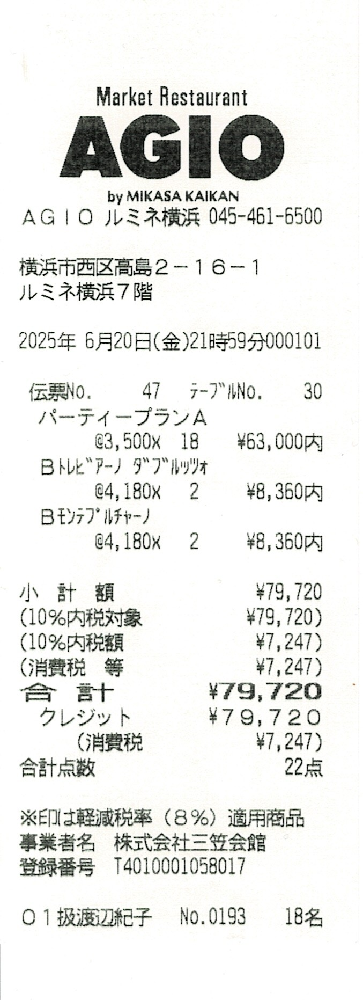

# 36-9
## 連絡状況

  
詳細

チェックなしが連絡つかない、ボールドフェイスはクラスラインに参加
- [x] 青木 惣昭
- [x] __東 浩一郎__
- [x] 伊賀 斉
- [x] 石川 悟
- [x] 石川 法人
- [x] __石橋 孝一郎__
- [ ] 大嶽 俊秀
- [x] 小野沢 昌行 （[瑠璃光寺](https://maps.app.goo.gl/va5qGeu6e96RqUE28)）
- [x] __木村 拓治__
- [ ] 車田 宏樹
- [x] __牛膓 喜裕__
- [x] __清水 智明__
- [x] 洲崎 文男 （[往年のお写真など](https://webview.isho.jp/journal/detail/abs/10.11477/mf.1402107264?p=firstTab) [参考](https://www.google.com/search?q=%22%E6%B4%B2%E5%B4%8E%E6%96%87%E7%94%B7%22+%22%E9%80%9D%E5%8E%BB%22)）
- [ ] 高野 浩一
- [x] 高橋 尚
- [x] 瀧田 栄一
- [x] __谷垣 賢一郎__
- [x] __寺尾 太郎__
- [ ] 丹羽 昇
- [x] __橋口 英幸__
- [x] __橋本 聡__
- [x] 平原 賢司 （[ご実家](https://maps.app.goo.gl/kpdkTyjwpZkmHck89)）
- [x] __枡田 至弘__
- [x] 三浦 司
- [x] __柳川 岳彦__
- [x] __山口 聡__
- [x] __横山 修__
- [x] 吉川 秀一
- [x] __米永 裕史__
- [x] __渡辺 浩志__
- [x] __阿部 純子__
- [x] __岡崎 ゆう子__
- [x] 岡田 千賀子
- [x] __柏木 薰__
- [x] __齊藤 冬紀__
- [x] __鈴木 直美__
- [ ] 堤 美奈子
- [x] __富塚 有美__
- [x] 中島 裕子
- [ ] 原沢 祐子
- [x] __布川 真理子__
- [x] __藤平 智花子__
- [x] __堀 容子__
- [x] __三島 久美__
- [x] 柳 なほみ
- [x] __矢羽田 なおみ__

## クラス会 2025-06-20 (横浜平日ディナー)
- 2025-06-20 (金) 19:00 - 22:30 (LO 21:30)
- 南欧料理 マーケットレストラン AGIO ルミネ横浜店
- 神奈川県横浜市西区高島2-16-1
- ルミネ横浜店7F
- 045-461-6500
- [横浜駅からAGIO](https://maps.app.goo.gl/4Ug8AuoKyfXVdsKa8) (起点は例示、変更できるよ)
- パーティープランA　¥ 3,500 (税込)
- __19名が参加できました！米さんも20:30頃には到着！__

  
詳細

こちらのプランで実質的に時間無制限で大丈夫なこと確認済みです。
お店的には「お待ちになっているお客様がいらっしゃる場合は2時間でお声がけさせていただくかも」という案内ですが「19:00スタートで2時間後だと21:00ですけど、その時間に順番待ちしているお客様いる可能性あります？」と念押したら「実際、遅い時間にそんなことも無いですね。承知しました。ラストオーダーが21:30ですが、いてくださって問題ないと思います。」とのことでした。

オーダーについても相談しました。16名で当日アラカルトはお店にとっては負荷高い（だよね）ので決めてもらったほうがもちろん助かるとのことだったので、上のようにしてあります。もちろん、追加でオーダーとか全然ありです。（本当に長時間ステイするなら追加でオーダーするのが人の道って気がする笑）

### 会計スキーム
基本PayPayで均等割オンラインで、PayPay外の人は現地で現金払い。
PayPayでの集金は事前(パーティープランA 3500円)と事後(男子料金、女子料金)の二回の予定。当日、「多めにだすよ！」って人は幹事にPayPayでカンパ送金とかあり。
ルミネカードで5%優待つくので、お店への支払いは幹事がルミネカードで実施。

### 会計事前
チェックありがPayPayで集金済み、名前のわかる表示名かメッセージで名前入れてくださいね
- [x] 東 浩一郎
- [x] 木村 拓治
- [x] 牛膓 喜裕
- [x] 寺尾 太郎
- [x] 橋本 聡
- [x] 枡田 至弘 「翌日は5時起きでゴルフ⛳️なので、ヨネの顔見て、22時には離脱、23時就寝を目指します。」
- [x] 横山 修
- [x] 岡崎 ゆう子
- [x] 齊藤 冬紀
- [x] 富塚 有美
- [x] 布川 真理子
- [x] 藤平 智花子
- [x] 堀 容子
- [x] 三島 久美 「翌日に山形まで テニス🎾合宿で朝４時から車運転 があるため、遅刻組の顔見てから 20時過ぎに帰ります。」
- [x] 矢羽田 なおみ 「当日開始時間に間に合いそうです」とのこと！！

### 当日、特別寄与者
金額は払う人決めてね方式、PayPayでカンパ送金も歓迎、現金の人はお釣り要らないようにね
- [x] 現金 橋口 英幸 (¥ 3,500)
- [x] 現金 柳川 岳彦 (¥ 5,000)
- [x] 現金 山口 聡 (¥ 5,000)
- [x] 現金 米永 裕史 (¥ 5,000)

### 会計事後
- 現時点での収入 `3500 * 16 + 5000 * 3 = 71000`
- 現時点での支出 `79720 * 0.95 = 75734` ルミネカード優待の5%オフ
  - 
- 差分 `71000 - 75734 = -4734`
- 差分を定額分支払い者数で折半 `-4734 / 16 = -295.875`

なので、「柳川くん、山口くん、よねさん、ごちそうさま！」
他の人は「一律、300円追加徴収」ってことにしましょう！

チェックありがPayPayで集金済み、名前のわかる表示名かメッセージで名前入れてくださいね
- [x] 東 浩一郎
- [x] 木村 拓治
- [x] 牛膓 喜裕
- [x] 寺尾 太郎
- [x] 橋口 英幸 2025-07-20に現金で受領しました
- [x] 橋本 聡
- [x] 枡田 至弘
- [x] 横山 修
- [x] 岡崎 ゆう子
- [x] 齊藤 冬紀
- [x] 富塚 有美
- [x] 布川 真理子
- [x] 藤平 智花子
- [x] 堀 容子
- [x] 三島 久美
- [x] 矢羽田 なおみ

## 男子会 2025-07-20 (横浜休日ランチ・横浜港クルーズ・山下公園・中華街)
- 2025-07-20 (日) 11:00 - 13:00 (2時間で声かけられました笑)
- ジャスミンパレス横浜店
- 神奈川県横浜市西区高島2-18-1
- そごう横浜店10F
- 045-548-6326
- [四ツ谷駅からジャスミンパレス横浜店](https://maps.app.goo.gl/6oCj8cjPGH5dNEo9A) (起点は例示、変更できるよ)
- __6名が参加__

  
詳細

- シーバス 横浜駅東口発・ハンマーヘッド・ピア赤レンガ・山下公園行 14:10 - 14:45
- 山下公園
- 山下町公園
- 横浜関帝廟
- CAFE SUMIRE 15:15 - 15:55
- [横浜関帝廟からCAFE SUMIRE](https://maps.app.goo.gl/RKBEH1Y9ta6v86jY6) (起点は例示、変更できるよ)

### 参加リスト
- [x] 木村 拓治
- [x] 牛膓 喜裕
- [x] 寺尾 太郎
- [x] 橋口 英幸 残念ながらランチのみ
- [x] 横山 修
- [x] 渡辺 浩志

## 学年同窓会 2025-10-12
- 2025-10-12 (日) 13:30 - 15:00 (開場 13:00)
- メルキュール横須賀
- 神奈川県横須賀市本町3-27
- 046-821-1111
- [四ツ谷駅からメルキュール横須賀](https://maps.app.goo.gl/rtXdJwoyLCwaRrUq5) (起点は例示、変更できるよ)
- 会費は１万円 現金のみで当日徴収

立食形式で、クラスごとにテーブルが配置されるそうです。
立っていることが辛い人もいるかもしれないので、椅子も用意されます。
クラスごとの発表のようなものはありませんが、後半に学年全体とクラスごとの写真撮影をします。
写真販売はせず、クラスラインで閲覧できるようにするらしい。
終わったらクラス会の二次会です！お店も既に予約済み！みっちゃんすごい！

### 参加リスト(正しくはアフターのクラス会の出欠予定になってます)
チェックありが現在の参加予定(なのでまだ変わるかも)、9月前半(当日の一月前)に参加の最終確認とのこと
- [ ] 青木 惣昭
- [x] 東 浩一郎
- [ ] 伊賀 斉
- [ ] 石川 悟
- [ ] 石川 法人
- [ ] 石橋 孝一郎
- [ ] 大嶽 俊秀
- [x] 木村 拓治 クラス会のみ
- [ ] 車田 宏樹
- [x] 牛膓 喜裕 クラス会のみ
- [ ] 清水 智明 忘年会はぜひ参加したい
- [ ] 高野 浩一
- [x] 高橋 尚
- [ ] 瀧田 栄一
- [ ] 谷垣 賢一郎
- [x] 寺尾 太郎
- [ ] 丹羽 昇
- [x] 橋口 英幸
- [x] 橋本 聡
- [x] 枡田 至弘
- [ ] 三浦 司
- [x] 柳川 岳彦
- [x] 山口 聡
- [x] 横山 修 クラス会のみ
- [ ] 吉川 秀一
- [ ] 米永 裕史
- [x] 渡辺 浩志
- [x] 阿部 純子 (供田)
- [x] 岡崎 ゆう子 (正法地)
- [ ] 岡田 千賀子
- [x] 柏木 薰 クラス会のみ
- [x] 齊藤 冬紀
- [ ] 鈴木 直美
- [ ] 堤 美奈子
- [x] 富塚 有美 (山口)
- [ ] 中島 裕子
- [ ] 原沢 祐子
- [ ] 布川 真理子
- [x] 藤平 智花子 (吉岡)
- [x] 堀 容子
- [x] 三島 久美 クラス会のみ
- [ ] 柳 なほみ
- [x] 矢羽田 なおみ

## クラス会 2025-10-12 (アフター学年同窓会)
- 2025-10-12 (日) 16:00 - 18:00 (少し早くするとかも可、学年会の様子を見て決めませう)
- 旬菜 横須賀中央東口店
- 神奈川県横須賀市大滝町2-22 だるま本店ビルB1
- 080-4799-4686
- [メルキュール横須賀から旬菜 横須賀中央東口店](https://maps.app.goo.gl/XCWGJgdjHv5x5GQd6) (起点は例示、変更できるよ)
- 個室、掘炬燵！
- とりあえず22名で予約、個室の最大定員は25名
- 3300円、飲み放題2時間付、現金払いなら1名分無料、9月末に3300*20/21 = 約3140をPayPayで事前集金予定
- 変更、キャンセルは9月末迄、みっちゃんに連絡してね！
- https://www.hotpepper.jp/strJ001282005/course_cnod31/
- 今後、仮に個室定員の【25名以上】に出席者が増えても「なんとか対応したい！」と思います！
- 出席: __21名！！__、ちなみに学年同窓会は __16名__ 予定

## クラス会 2025-11-08 (横浜休日ランチ)
- 2025-11-08 (土) お昼のランチ企画
- 場所は横浜
- ○が7名、△が5名、個室が微妙な人数なのでスケジュールが判明したら早めにみっちゃんへ！

## クラス会 2025-12-19 (大忘年会)
- 2025-12-19 (金) 19:00 - 
- ちゅら屋 相鉄ジョイナス店
- 神奈川県横浜市西区南幸1-5-1 相鉄ジョイナスB2
- 045-317-3610
- [四ツ谷駅からちゅら屋 相鉄ジョイナス店](https://maps.app.goo.gl/8pAX2mwp5VTL3rxB6) (起点は例示、変更できるよ)
- 個室じゃないけど18名が纏まって座れる
- とりあえず橋口くんが16名で予約済み、お店としては人数増え次第連絡欲しいとのこと
- 5000円、飲み放題
- 11月末で参加者を一旦確定させたい
- https://shop.create-restaurants.co.jp/1677/
- 今のところ、出席予定: __17名！！__、検討中: 2名、まだまだ参加者募集中！！

### 参加リスト
チェックありが現在の参加予定(なのでまだ変わるかも)
- [ ] 青木 惣昭
- [ ] 東 浩一郎
- [ ] 伊賀 斉
- [ ] 石川 悟
- [ ] 石川 法人
- [ ] 石橋 孝一郎
- [ ] 大嶽 俊秀
- [x] 木村 拓治
- [ ] 車田 宏樹
- [x] 牛膓 喜裕
- [x] 清水 智明 フライング気味にチェックwww
- [ ] 高野 浩一
- [x] 高橋 尚 20時頃到着
- [ ] 瀧田 栄一
- [ ] 谷垣 賢一郎
- [x] 寺尾 太郎
- [ ] 丹羽 昇
- [x] 橋口 英幸
- [x] 橋本 聡
- [x] 枡田 至弘
- [ ] 三浦 司
- [x] 柳川 岳彦
- [x] 山口 聡
- [x] 横山 修
- [ ] 吉川 秀一
- [ ] 米永 裕史
- [x] 渡辺 浩志
- [ ] 阿部 純子
- [x] 岡崎 ゆう子
- [ ] 岡田 千賀子
- [ ] 柏木 薰
- [x] 齊藤 冬紀
- [ ] 鈴木 直美
- [ ] 堤 美奈子
- [x] 富塚 有美
- [ ] 中島 裕子
- [ ] 原沢 祐子
- [ ] 布川 真理子 検討中
- [ ] 藤平 智花子 検討中
- [x] 堀 容子
- [x] 三島 久美
- [ ] 柳 なほみ
- [ ] 矢羽田 なおみ
